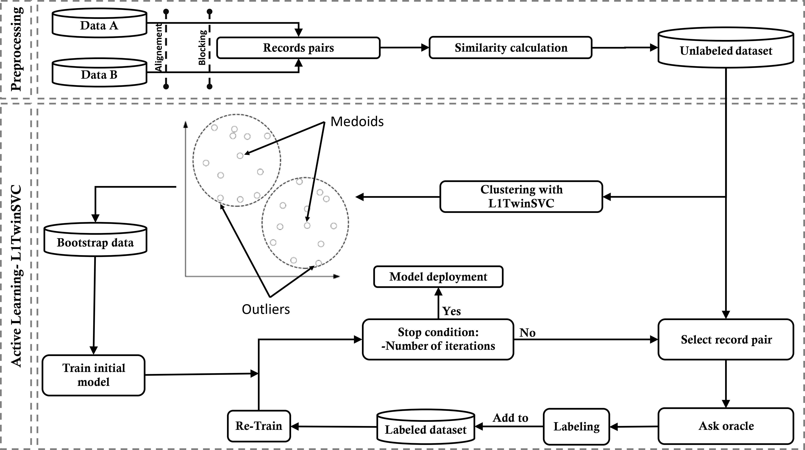

L1-TwinSVC Clustering for Efficient Entity Resolution: Solving the Cold Start Problem through Active Learning
=============


|  | 
|:-----------------------------------------------------:| 
|    *Entity Resolution with AL-L1TwinSVC workflow*     |

AL-L1-TwinSVC Framework for performing entity and text matching using
L1-TwinSVC Clustering for solving the cold start problem through active learning.
It provides built-in Active learning and utilities that enable you to train and apply
L1-TwinSVC with active machine learning for entity matching with less training data.

# Paper and Data

For details on the architecture of the models used, take a look at our
paper [L1-TwinSVC Clustering for Efficient Entity Resolution: Solving the Cold Start Problem through Active Learning](). All
public datasets used in can be downloaded from the [datasets page
1](https://github.com/anhaidgroup/deepmatcher/blob/master/Datasets.md)
and [datasets page
2](https://github.com/wbsg-uni-mannheim/UnsupervisedBootAL/tree/master/datasets).

# Datasets:
In the datasets folder you can find all data sets
used for experimenation:

## Structured datasets:
1. Amazon-Google 
2. BeerAdvo-RateBeer
3. DBLP-ACM
4. DBLP-GoogleScholar 
5. Fodors-Zagats 
6. iTunes-Amazon 
7. Walmart-Amazon


## Dirty Datasets :
8. DBLP-ACM 
9. DBLP-GoogleScholar 
10. iTunes-Amazon 
11. Walmart-Amazon 
12. WDC-Headphones 
13. WDC-Phones

## Textual:
14. Abt-Buy 
15. Amazon-Google

For every dataset pair we provide the initial datasets, feature vector
files and files including matching labels for the train and test sets.

Results: In the results folder you can find all result files for AL-LTwinSVC Framework.


# Installation

We currently support only Python versions 3.5+. Installing using pip is
recommended:

``` 
pip install -r requirements.txt
```


# Quick Start: AL-L1-TwinSVC in 30 seconds

There are tow main steps in using AL-L1-TwinSVC:

### 1.  Data processing: Load data and create Feature Vector File.

1.1. choose dataset under AL-L1-TwinSVC/createFv/CTE.py

1.2. run AL-L1-TwinSVC/createFv/createFeatureVectorFile.py script

### 2.  Run active learning process:

2.1. Under AL-L1-TwinSVC/cte.py:

    2.1.1. Choose dataset.
    2.1.2. Select the number of AML iterations.
    2.1.3. Select the machine learning models.

2.2. Run AL-L1-TwinSVC/main.py script.


# The Team

AL-L1-TwinSVC was developed by sultan moulay slimane university PhDs
JABRANE Mourad and TOULAOUI Abdelfattah, under the supervision of Prof. HADRI
Aissam and Prof. HAFIDI Imad.
